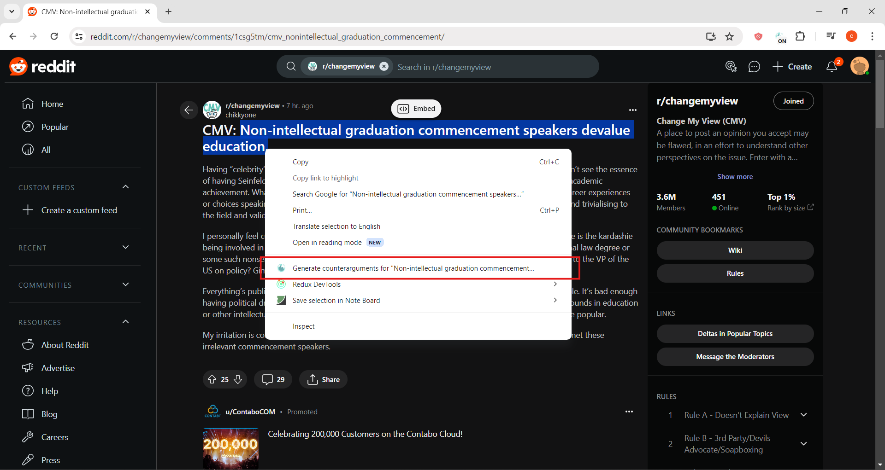
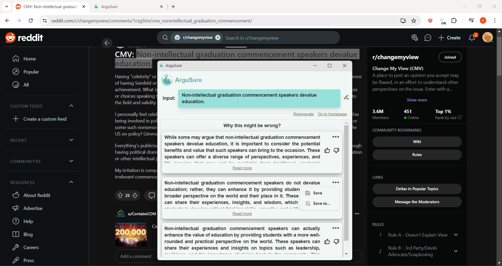

# Chrome Extension for ArguSure

Powered by Google's multimodal LLM called Gemini, ArguSure is a Chrome Extension for Counterargument Generation. With the goal of alleviating the negative effects of filter bubbles, it is designed not to tell you what is right or wrong, but to introduce you to different perspectives you might miss because of how some algorithms on the internet work.

For more info, please see [this repository](https://github.com/cj-mm/ArguSure).

### Sample screenshots:

#### Context Menu

#### Window Popup

#### Extension's Popup

#### Extension's Popup with Counterarguments

