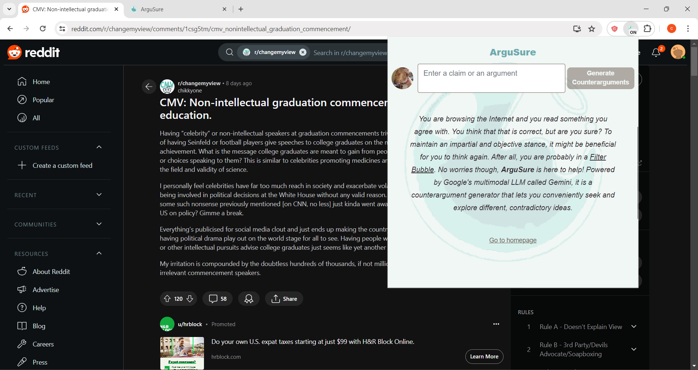
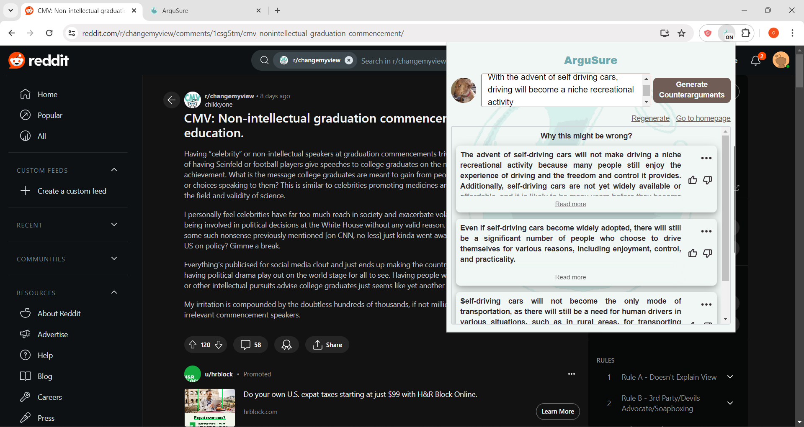
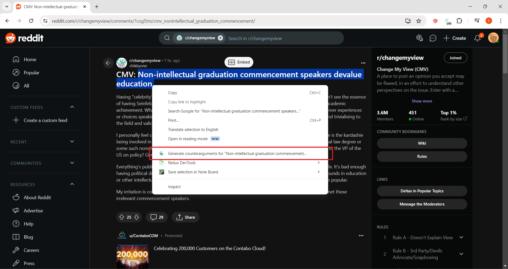
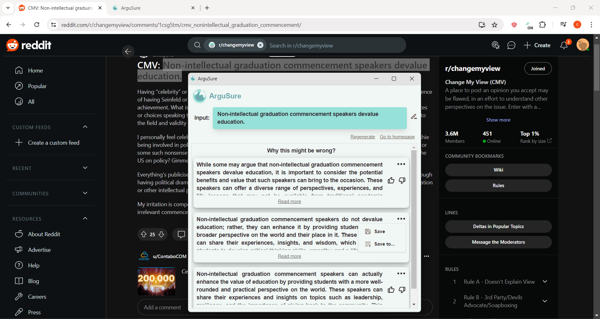

<div align="center">
  
  <h1>ArguSure Chrome Extension</h1>
</div>

## 📖 About

Accompanied by [ArguSure Web App](https://github.com/cj-mm/ArguSure-Web-Application) and powered by Google's multimodal LLM called Gemini, **ArguSure** is a Chrome Extension for Counterargument Generation. With the goal of alleviating the negative effects of filter bubbles, it is designed not to tell you what is right or wrong, but to introduce you to different perspectives you might miss because of how some algorithms on the internet work (recommendation algorithms tend to reinforce
your existing beliefs by only showing you content you already agree with).

---

## ✨ Features

-   **Right-Click Generation** — Highlight any text on a webpage, right-click, and select
    "Generate counterarguments for..." to instantly open the ArguSure web app with the
    selected text pre-loaded
-   **Extension Popup** — Click the toolbar icon to manually input any claim or argument
    and generate counterarguments directly within the extension
-   **Multi-Step AI Pipeline** — Validates input as an arguable claim, categorizes it,
    then generates three structured counterarguments each with a Summary, Body, and Sources
-   **Account Integration** — Connects to your ArguSure account so generated
    counterarguments are saved to your history automatically
-   **Like / Dislike & Save to Topics** — Interact with generated counterarguments directly
    from the extension popup

---

## 🖼️ Screenshots

### Extension Popup



### Extension Popup with Counterarguments



### Right-Click Context Menu



### Web App Window (Right-Click Flow)



---

## 🛠️ Tech Stack

| Layer              | Technology                                       |
| ------------------ | ------------------------------------------------ |
| Framework          | React 18, TypeScript                             |
| Styling            | Tailwind CSS, Flowbite React                     |
| State Management   | Redux Toolkit, Redux Persist                     |
| AI                 | Google Gemini API                                |
| Build Tool         | Vite (dual-config for popup and content scripts) |
| Backend            | Node.js / Express (via ArguSure Web App)         |
| Extension Standard | Chrome Manifest V3                               |

---

## 🚀 Running Locally (Development)

### Prerequisites

-   Node.js v18 or higher
-   npm v9 or higher
-   A [Google AI Studio](https://aistudio.google.com/app/apikey) Gemini API key
-   The [ArguSure Web App](https://github.com/cj-mm/ArguSure-Web-Application) running locally or
    deployed (for authentication and saving counterarguments)
-   Google Chrome

### 1. Clone the repository

```bash
git clone https://github.com/cj-mm/ArguSure-Chrome-Extension.git
cd ArguSure-Chrome-Extension
```

### 2. Install dependencies

```bash
npm install
```

### 3. Configure environment variables

Create a `.env` file in the project root:

```env
VITE_GEMINI_API_KEY=your_gemini_api_key_here
VITE_API_BASE_URL=http://localhost:5000  # For local development pointing to a local backend
```

### 4. Build the extension

```bash
npm run build
```

This runs the full build pipeline:

-   Compiles TypeScript
-   Bundles the popup React app via Vite
-   Bundles the content script separately as an IIFE
-   Generates `dist/manifest.json` with correct paths

### 5. Load into Chrome

1. Open Chrome and navigate to `chrome://extensions`
2. Enable **Developer Mode** (toggle in the top-right corner)
3. Click **"Load unpacked"**
4. Select the `dist/` folder from this project

The ArguSure extension icon will appear in your Chrome toolbar.

### 6. After making code changes

Every time you change source files, rebuild and reload:

```bash
npm run build
```

Then go to `chrome://extensions` and click the **refresh icon (↺)** on the ArguSure
extension card. Chrome does not hot-reload extensions automatically.

---

## 🔐 Chrome Permissions

The extension requests the following permissions:

| Permission     | Why It's Needed                                                          |
| -------------- | ------------------------------------------------------------------------ |
| `contextMenus` | To register the right-click "Generate counterarguments for..." menu item |
| `activeTab`    | To communicate with the currently active tab                             |
| `scripting`    | To programmatically interact with page content                           |
| `cookies`      | To read the auth session cookie set by the ArguSure web app              |

---

<div align="center">
  <p>Built by <a href="https://github.com/cj-mm">cj-mm</a></p>
</div>
